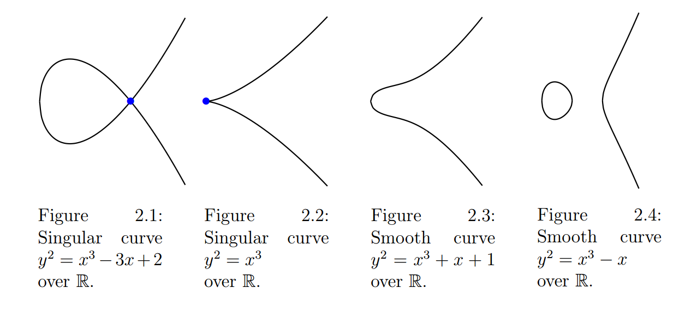
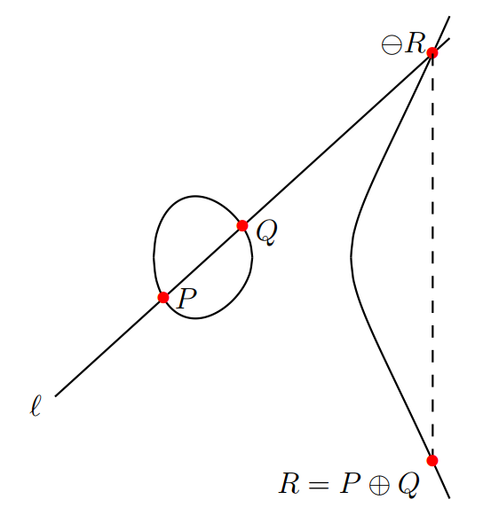
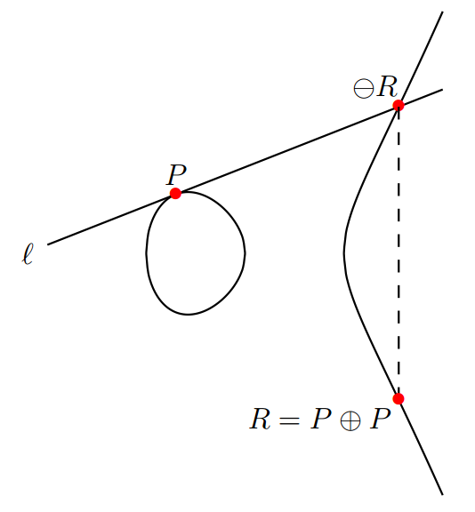
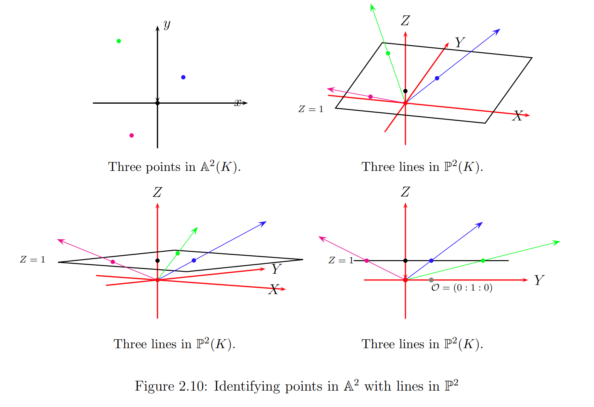

前段时间跟着Pairings For Beginners这篇简单学习了一下pairings，现在觉得还是有必要自己做点记录，不然一些细节实在是容易忘记。

<!--more-->

## 参考文档指路

本文主要参考论文：

[PairingsForBeginners.pdf (squarespace.com)](https://static1.squarespace.com/static/5fdbb09f31d71c1227082339/t/5ff394720493bd28278889c6/1609798774687/PairingsForBeginners.pdf)

<br/>

<br/>

## 基本概念

仿射坐标和射影坐标、r-torsion、divisor、genus、froebius endomorphism、divisor group、有理函数(及与除子的对应)、pole和zero、Weil reciprocity、配对的计算。

### 椭圆曲线

椭圆曲线虽然大家已经很熟悉，但是一般来说，我们常见到的都是仿射坐标意义下的曲线方程，也就是：
$$
E: \quad y^2 + a_1xy + a_3y = x^3 + a_2x^2 + a_4x + a_6  \quad over \; F
$$
这是长Weierstrass曲线方程（general Weierstrass equation），其定义在域F上。

<br/>

#### 点群结构

实际上，对于一条确定的曲线，上述方程的所有解$(x,y)$加上无穷远点$O$，就构成了该曲线的点群。而这方程的所有解并不全在基域F上，而应该在F的代数闭包上：
$$
(x,y) \in \overline{F}
$$
因此一般常用的一次域中的点群结构，实际上应该是这个最大点群的子群。

<br/>

#### 短Weierstrass曲线

当域的特征不为2、3时(一般来说曲线都是定义在大素数域或者大素数域的扩域上的)，我们可以对曲线方程连续做如下两次变换：
$$
y \rightarrow  \frac{y − a_1x − a_3}{2}
$$

$$
(x, y) \rightarrow (\frac{x-3b_2}{36} , \frac{y}{108})
$$

> 这里要求特征不为2、3，是因为在这样的域上没有办法完成上面的两步变换

此时曲线方程就变为了我们最常见的短Weierstrass曲线方程（short Weierstrass equation）：
$$
E: \quad y^2 = x^3 + ax + b \quad over \; F
$$
<br/>

奇异曲线

打CTF应该多少遇到过奇异曲线（singular curve），一般来说奇异曲线可以理解为曲线方程有重根，也就是判别式$\Delta = 4a^3+27b^2 = 0$，这样的曲线方程分两重根和三重根分别可以写成：
$$
y^2 = (x-\alpha)^2(x-\beta)
$$

$$
y^2 = x^3
$$

他们可以各自同态到易计算dlp的域，因此完全不具备安全性。

> 具体同态到什么域在这里就不写了

事实上，奇异曲线甚至不能算是椭圆曲线，论文中对于奇异曲线给出的定义是：对于曲线$f$，如果存在某一点$P=(x_P,y_P)$，使得这一点的偏导数$\frac{\partial{f}}{\partial{x}}$和$\frac{\partial{f}}{\partial{y}}$同时消失，那么这样的曲线就叫做奇异曲线。

>  可以看出其实这也是在讲曲线方程有重根

而不存在这样的点的曲线就称为非奇异曲线或者光滑曲线，两种曲线的区别在R上的图像很容易看出：



<br/>

#### 仿射空间下的群运算

椭圆曲线要成为一个群，不仅需要定义他的元素，还需要定义这些元素之间的一个二元运算，这个运算也就是点的加法。

> 实际上大家对ECC上点的加法应该都很熟悉，但这里会给出更为准确的定义，方便后续配对内容的理解

要直白的描述群的计算法则，用实数域R上的ECC应该最为清晰。对于曲线上任意两点P、Q，其对应的点加法计算方式为：

+ 若$P \neq Q$，则连接$P,Q$并延长，交曲线于第三点$R'$，此时$R'$关于x轴的对称点R即为结果，即$R = P \oplus Q$，用图像表示就是：

  

+ 若$P = Q$，此时点的加法也就是P的二倍点运算，具体运算方法为作曲线在P点的切线并延长，交曲线于$R'$，此时$R'$关于x轴的对称点R即为结果，即$R = P \oplus P = [2]P$，用图像表示就是：

  

要如何用代数的语言来描述这个运算法则呢？事实上，这种群运算可以统一表述为一条直线$y = \lambda x + \upsilon$和三次曲线$y^2 = x^3 + ax + b$的相交运算，把直线方程代入曲线方程就可以得到：
$$
(\lambda x + \upsilon)^2 = x^3 + ax + b
$$
这是关于x的三次方程，重根按重数算的话，其根就代表着直线与曲线的三个交点。那么当我们知道了其中两个点时，我们可以唯一确定：

+ 直线方程（$P,Q$不等时为弦线（chord），$P,Q$相等时为切线（tangent））
+ 方程的第三个根，也就是$R‘$的横坐标

之后将得到的$R’$在x轴上翻转得到$R$，我们就完成了点的加法计算。这也就是点群计算法则的代数描述。

> 这里可以进行一点加法公式的推导，因为后面射影空间中的群运算会用到。
>
> 首先要得到直线斜率$\lambda$，分$P,Q$相同或不同分别为：
>
> + 求曲线方程在$P$处的导数，为$\frac{3x_P^2 + a}{2y_P}$
> + 直接由$P,Q$两点计算出斜率，为$\frac{y_P-y_Q}{x_P-x_Q}$
>
> 之后自然就有截距$\upsilon$
>
> 然后就该计算$R$的坐标，由上述部分我们知道$P,Q,R$的横坐标是三次方程的三个根，因此有：
> $$
> (x - x_P)(x-x_Q)(x-x_R) = x^3 + ax + b - (\lambda x + \upsilon)^2
> $$
> 化简一下得到：
> $$
> (x - x_P)(x-x_Q)(x-x_R) = x^3 - \lambda^2x^2 + (a - 2\lambda\upsilon)x + b - \upsilon^2
> $$
> 可以看出，求解$R$的横坐标其实只需要对比一下方程两侧$x^2$的系数：
> $$
> -(x_P+x_Q+x_R) = -\lambda^2
> $$
> 所以得到：
> $$
> x_R = \lambda^2 - x_P - x_Q
> $$
> 而并不需要真的去求根，得到$R$的横坐标之后，由于$R' = (x_R,-y_R)$在直线$y = \lambda x + \upsilon$上，因此有：
> $$
> -y_R = \lambda x_R + \upsilon
> $$
> 所以自然也就得到了$R$的纵坐标：
> $$
> y_R = -(\lambda x_R + \upsilon)
> $$

<br/>

#### 点群的单位元

而点要成群，还需要一个表示恒等的单位元$O$，其应该满足对任意点$P$有：
$$
P \oplus O = O \oplus P = P
$$
什么样的点才能满足这样的单位元性质？直接从刚才的群运算法则中似乎很难想出来——为此定义了一个无穷远点$O$当作单位元，其**同时处于y轴最高处和最低处**。

结合此定义，我们可以顺理成章地推出一个点的逆元，对于任意点$P$来说，其逆元应该满足：
$$
P \oplus (-P) = O
$$
联系点运算法则的几何描述，就知道$P$的逆元实际上就是其关于x轴的对称点。连接这两点得到一条x轴的垂线，可以认为其交曲线的第三点就是无穷远点——这个点也符合刚才所说的同时处于y轴最高处和最低处。

但这样的无穷远点实际上非常的反直觉，因为：

+ 从ECC的图形上看，这样的垂线根本不会和曲线交于第三点
+ 很显然不同垂线对应的$O$的横坐标不一样

而要更合理的表述这个单位元，需要“升维”，为此引入了射影坐标。

<br/>

#### 仿射坐标和射影坐标

从刚才的种种角度可以看出，仿射空间（affine space）下的方程，曲线的点坐标都是二元组$(x,y)$的形式，有一个弊端很大的弊端在于我们无法用坐标来精确的表述点群的单位元$O$，也就是无穷远点。所以仿射意义下的曲线点集合我们只能手动把无穷远点补上，而无法写成一个统一形式，也就是写为：
$$
E = \{(x,y) \;|\;y^2 = x^3 + ax + b \} \cup \{O\}
$$
这样虽然也能够表示，但是很难不觉得这里“不够精准”，而射影坐标就给出了一个能够精准表示椭圆曲线点集合的方法。

在射影空间（projective space）中，一个点的坐标从二维升到了三维，变成了三元组$(X:Y:Z)$的形式(射影坐标一般会用大写字母和冒号来表示)。此时仿射坐标二维平面上的一个点，则与射影坐标三维空间中的一条线相对应：
$$
(x,y) \leftrightarrow (\lambda x : \lambda y : \lambda) \quad , \quad \lambda \in \overline{F^*}
$$

> 这里的$\overline{F^*}$是指去除零元的代数闭包，也就是说，一个仿射坐标下的点，其实对应的是一条射影坐标下经过原点、但又去除原点的线。这也说明在射影坐标意义下，下方形式的两个点坐标是等价的：
> $$
> (X:Y:Z) \sim (\lambda X : \lambda Y : \lambda Z)
> $$

这一部分结合图来理解就很直观：



然而，虽然一个仿射坐标下的点对应的是射影坐标下的一条线，然而我们还是希望在两种坐标体系下，能做一个点和点之间的对应，因此，我们取Z=1这个平面来截这些直线，截的的点就是射影坐标下的对应点：
$$
(x,y) \rightarrow (x:y:1)
$$
同时，也可以直观地看出，无穷远点实际上就是Y轴这条直线的对应点，因此就可以取单位元为：
$$
O = (0:1:0)
$$
如此就完整的用坐标定义了整个点集合。同时由上面可以看出，将仿射意义下的曲线转换到射影意义下的曲线，只需要做如下映射：
$$
x \rightarrow \frac{X}{Z} \quad , \quad y \rightarrow \frac{Y}{Z}
$$
就得到：
$$
\frac{Y^2}{Z^2} = \frac{X^3}{Z^3} + a\frac{X}{Z} + b
$$
两边同时乘Z^3，就得到了射影坐标里的短Weierstrass曲线方程：
$$
E_{\mathbb{P}}:Y^2Z = X^3 + aXZ^2 + bZ^3
$$
以及一个完整定义的点集合：
$$
E = \{(X:Y:Z) \;|\;Y^2Z = X^3 + aXZ^2 + bZ^3 \}
$$

与仿射平面的点群结构相对应的，所有在基域的代数闭包上满足上述方程的点的集合，就构成了该射影曲线的射影闭包（projective closure of E）。

> 所以sage里看到的坐标都是三元组的形式，因为实际上那就是用Z=1去截直线得到的仿射坐标，常用的也都是出现在基域的所有点构成的群，这个群是射影闭包的子群。

> 这个换元的方式对应的是齐次射影坐标（homogenous projective coordinates），此外还有不少其他的射影坐标，如Jacobian射影坐标。

<br/>

#### 射影空间下的群运算

有了射影坐标之后，就可以把仿射坐标下的点群元素升维到射影坐标下，那么与之对应的，点之间的二元运算也就需要一个新的定义。回顾一下仿射空间中计算$R = P \oplus Q$的步骤：

+ 由$P,Q$两点坐标确定直线方程$y = \lambda x + \upsilon$
+ 计算直线方程$y = \lambda x + \upsilon$与曲线方程$y^2 = x^3 + ax + b$的交点$R'$，也即求一个三次方程的根
+ 其剩余的根即为$R$的横坐标，交点$R'$的x轴对称点即为$R$

这样的过程同样适用于射影空间，然而实际上来说，在射影空间中存在有效的手段避免求逆，从而达到运算加速。我们可以看一下具体加速效果，按论文的说法，我们先定义以下三种计算复杂度：

+ 乘法复杂度，记为$\textbf{M}$
+ 平方复杂度，记为$\textbf{S}$
+ 求逆复杂度，记为$\textbf{I}$

那么对于仿射空间的点群计算来说，其计算$P \oplus Q$与计算$[2]P$的复杂度就分别为：

+ $2\textbf{M} + \textbf{S} + \textbf{I}$
+ $2\textbf{M} + 2\textbf{S} + \textbf{I}$

> 这一部分对照一下上面仿射空间的群运算部分即可，这里的乘法似乎不算小常数的乘法（比如$3x_P$之类）

而如果我们将计算放至射影空间中，也就是做如下映射：
$$
x \rightarrow \frac{X}{Z} \quad , \quad y \rightarrow \frac{Y}{Z}
$$
代入到仿射空间群运算公式中得到：
$$
x_R = \lambda^2 - x_P - x_Q
$$

$$
\rightarrow \frac{X_R}{Z_R} = (\frac{\frac{Y_P}{Z_P}-\frac{Y_Q}{Z_Q}}{\frac{X_P}{Z_P}-\frac{X_Q}{Z_Q}})^2 - \frac{X_P}{Z_P} - \frac{X_Q}{Z_Q}
$$

$$
y_R = \lambda(x_P-x_R) - y_P
$$

$$
\rightarrow \frac{Y_R}{Z_R} = (\frac{\frac{Y_P}{Z_P}-\frac{Y_Q}{Z_Q}}{\frac{X_P}{Z_P}-\frac{X_Q}{Z_Q}})(\frac{X_P}{Z_P} - \frac{X_R}{Z_R}) - \frac{Y_P}{Z_P}
$$

但这还不能体现他加速运算的关键，核心的一步在于射影空间中的从原点出发的一条线对应仿射空间中的同一个点，因此其Z轴坐标可以人为设定，也就是说我们可以设置$Z_R$的值为：
$$
Z_R = Z_PZ_Q(X_PZ_Q-X_QZ_P)^3
$$
这样设置的一个好处在于：将其代入上面的计算式中并通分，可以消去所有的分母，而只剩下分子的计算，此时我们就得到了$X_R$和$Y_R$的表达式：
$$
X_R = (X_PZ_Q-X_QZ_P)(Z_PZ_Q(Y_PZ_Q-Y_QZ_P)^2-(X_PZ_Q-X_QZ_P)^2(X_PZ_Q+X_QZ_P))
$$

$$
Y_R = Z_PZ_Q(X_QY_P-X_PY_Q)(X_PZ_Q-X_QZ_P)^2 - (Y_PZ_Q-Y_QZ_P)((Y_PZ_Q-Y_QZ_P)^2Z_PZ_Q + (X_PZ_Q+X_QZ_P)(X_PZ_Q-X_QZ_P)^2)
$$

可以发现，我们按照这个公式计算射影坐标的话，就完全不存在逆元的操作了。

> 直接说设置$Z_R$为这个值，思维似乎有点跳跃。反过来说，先通分能够得到这样一个分母，然后把他设置为$Z_R$，从而规避掉分母运算，这样更加顺理成章

此时统计其复杂度（要注意其中很多计算结果可以复用）为$12\textbf{M}+2\textbf{S}$，而求逆的复杂度一般满足$\textbf{I} \gg 20\textbf{M}$，因此相对于仿射坐标中的$2\textbf{M}+\textbf{S} + \textbf{I}$，射影空间中的计算显然优化了复杂度。对于点的二倍操作也是同理，同样列出计算式可以知道在射影空间中的计算复杂度为$5\textbf{M}+6\textbf{S}$，依然明显优于仿射空间下的$2\textbf{M}+2\textbf{S} + \textbf{I}$。

而事实上，相比于齐次射影坐标，诸如雅可比射影坐标的其余射影坐标有时能够更大力度的优化点群计算，这里可以参考论文的例2.1.10。

> 事实上一些素数的选择也对域中计算有显著优化，比如ECC常用的$q = 2^{256} - 2^{224} + 2^{192} - 2^{96} + 1$

<br/>

<br/>

### Torsion, endomorphisms and point counting

> 没太总结出更精炼的这一节的标题，就直接用论文的好了

在未明确指定之前，本小节讨论的都是$F_q$下的椭圆曲线，即在模素数下的一次域进行的曲线运算。

#### Fq下的ECC群结构

在讨论torsion之前，首先需要明确一下之后要研究的椭圆曲线群结构。一个事实是，$E(F_q)$下的椭圆曲线群结构只有以下两种可能：

+ 本身是个循环群，有生成元
+ 同构于两个循环群的乘积$Z_{n_1} \times Z_{n_2}$，并且n1是n2的因子

> 我不会证明，详细可以见论文里的引用

<br/>

#### r-torsion

先说定义：对于曲线$E(F_q)$的闭包$E(\overline{F_q})$，所有满足$rP = O$的点$P$构成的集合称为$E(\overline{F_q})$的r-torsion。

这里需要注意的地方是：

+ 在闭包下的才是完整的r-torsion，一次域中所有满足$rP = O$的点$P$构成的集合仅仅是r-torsion中的一个子群
+ r-torsion的结构是曲线配对的核心，在之后会讲到

<br/>

#### point counting

对于使用ECC的加密体制，其基于ECDLP的困难性，而ECDLP的主要求解复杂度在于其群阶的最大素因子，也因此安全曲线往往是群阶为素数的曲线，这使得我们需要解决两个问题：

+ 如何快速计算ECC的群阶
+ 如何快速找到这样的阶为素数（或最大素因子较大）的曲线

<br/>

##### Hasse bound

其实对椭圆曲线求阶时，不少师傅应该已经发现过一个有趣的巧合——一个椭圆曲线的阶(即点的个数)似乎总是和模数q很接近。事实上这背后是有理论依据的，也就是Hasse bound，它表明一个椭圆曲线上的点的数量与模数q应该有如下关系：
$$
q + 1 - 2\sqrt{q} \leq \#E(F_q) \leq q + 1 + 2\sqrt{q}
$$
> 为什么曲线阶总是比较接近模数q，这个问题其实很符合直觉：因为对于所有$x \in [0,q-1]$来说，计算对应的$x^3 + ax + b$，得到的值当作随机值的话，当然大概会有一半是二次剩余，一半是二次非剩余。而二次剩余的情况也就对应了曲线上的两点，所以曲线阶自然就很接近模数q

不妨记实际的阶为：
$$
\#E(F_q) = q + 1 - t \quad , |t| \leq 2\sqrt{q}
$$
这个偏移量 t 称为 trace of Frobenius，之后会用到。

> 论文中提及到一个有趣的事实，当q是素数的时候，所有在 $[q + 1 - 2\sqrt{q} , q + 1 + 2\sqrt{q}]$ 范围内的数值N，都一定可以作为Fq下某一条椭圆曲线的阶。所以理论上来说给出素数q，和在Hasse bound内的曲线阶，也一定可以反着生成曲线
>

<br/>

##### Frobenius endomorphism π

Frobenius自同态是$E$到$E$的一个同态，记为：
$$
π : E \rightarrow E \quad , \quad(x,y) \rightarrow (x^q,y^q)
$$
对于曲线闭包$E(\overline{F_q})$来说，这个同态当然满足封闭性，也就是同态前后的点都在曲线闭包里。但是有一个地方需要注意，由于欧拉定理$a^p = 1 \quad(mod\;p)$的存在，对基域的曲线$E(F_q)$来说，这是个恒等映射。也就是说要看出Frobenius自同态的非平凡行为，必须要到$E(\overline{F_q}) \backslash E(F_q)$才行。

> 进一步推广到如下同态：
> $$
> π^i : E \rightarrow E \quad , \quad(x,y) \rightarrow (x^{q^i},y^{q^i})
> $$
> 这个映射只有在$E(\overline{F_q}) \backslash E(F_{q^i})$才是非平凡的

这其实是个充分必要条件，也就是说下面的两个事件等价：
$$
P \in E(F_q) \quad \leftrightarrow \quad \pi(P) = P
$$
由此可以推出：
$$
P \in E(F_q) \quad \leftrightarrow \quad ([1]-\pi)P = O
$$
这代表着所有基域曲线$E(F_q)$上的点都会满足$([1]-\pi)P = O$，因此我们得到了一个点的数量的表示方法：
$$
\#E(F_q) = \#ker([1]-\pi)
$$
也就是$E(F_q)$的阶等于同态$([1]-\pi)$的同态核大小。而由于这个同态可分，因此有：
$$
\#ker([1]-\pi) = deg([1]-\pi)
$$
再应用Cauchy-Schwarz不等式就有：
$$
|deg([1]-\pi) - deg([1]) - deg(\pi)| \leq 2\sqrt{deg([1])deg(\pi)}
$$
代入$deg([1]) = 1, deg(\pi) = q$，就推出了Hasse bound对应的不等式了。

<br/>

##### 自同态环

ECC的自同态环（endomorphism ring）是曲线理论的一个重要概念，$E$的自同态环记作$End(E)$：

+ 环中元素为$E$到自身的所有映射

  > 比如对所有$m \in Z$，$\psi:P \rightarrow [m]P$显然都是$End(E)$中的元素，这叫做multiplication-by-m map
  >
  > 刚才的Frobenius自同态自然也是

+ 环中加法满足$(\psi_1+\psi_2)(P) = \psi_1(P) + \psi_2(P)$

+ 环中乘法满足$(\psi_1\psi_2)(P) = \psi_1(\psi_2(P))$

而对于$End(E)$，所有$m \in Z$，$\psi:P \rightarrow [m]P$是环中的平凡元素，如果其中存在任何的非平凡元素，就称该曲线$E$有 complex multiplication (CM)。显然，Frobenius自同态对于所有$E(F_q)$都是个非平凡元素，也就代表着所有$E(F_q)$都有CM。

> 由于$End(E)$中的非平凡元素依然需要映射前后的点都需要在同一个曲线上，所以并不太容易直接想到例子。论文中给出的一个示例为：
> $$
> E / K : y^2 = x^3 + ax
> $$
>
> $$
> \psi :\quad (x,y) \rightarrow (-x,iy) \quad , \quad i^2 = -1
> $$
>
> 先验证一下映射后的点也在原曲线上：
> $$
> (iy)^2 = (-x)^3 + a(-x) \rightarrow y^2 = x^3 + ax
> $$
> 等式成立，因此其为$End(E)$中的元素，并且为非平凡元素。简单分析一下这个元素的性质：
>
> + $\psi \circ \psi(x,y) = -(x,y)$，这意味着$\psi \circ \psi = [-1]$
>
> + 这其实说明了一个$Z[i]$到$End(E/ K)$的环同态，即$m+ni \rightarrow [m] + [n]\circ psi$
>
> + 在$K$的特征不为0的时候，这是一个环同构
>
>   > 最后这点没太明白，为什么只有有限的时候才算同构

<br/>

##### Frobenius自同态的特征多项式

可以看出，对$E(\overline{F_q})$上的所有点$P$，Frobenius自同态都满足：
$$
(\pi^2 - [t]\circ \pi + [q])P = O
$$
其中t就是之前提到的trace of Frobenius，这代表着Frobenius自同态的特征多项式就是：
$$
x^2 - tx + q = 0
$$
一个简单的测试脚本如下：

```python
from Crypto.Util.number import *

p = getPrime(256)
E = EllipticCurve(Zmod(p), [randint(0,p),randint(0,p)])
n = E.order()

f = E.frobenius_polynomial()

print(f)
print(n - p)
```

回顾一下之前的曲线群阶计算式：
$$
\#E(F_q) = q + 1 - t
$$
可以看出，得到了trace of Frobenius就等价于得到了群阶，而得到了Frobenius自同态的特征多项式也就得到了trace of Frobenius，这几个问题可以相互转化。

而接下来要讲的Schoof’s algorithm就是计算曲线群阶的多项式时间算法，其核心思路就在于计算出trace of Frobenius，为此我们需要先介绍division polynomials的概念。

<br/>

##### division polynomials

论文中很直接的描述了division polynomials的本质作用：对于$l$-$th$ division polynomials，记为$\Psi_l(x)$，其根可以显示出$l$-torsion中的点坐标。

> 具体如何根据曲线的a、b去递归计算出division polynomials文章中没讲，但指了个路，可以去看

这里简单描述一下论文的例子帮助理解。假设有曲线$E/F_{101}:y^2 = x^3 + x + 1$，其阶$\#E = 105 = 3\cdot 5 \cdot 7$，我们分别对该曲线的2，3，5，7，11-$th$ division polynomials进行因式分解，容易得到：

+ 在3，5，7时能分解出单次项，这些单次项中存在着能lift到$E(F_q)$上的横坐标，代表着存在对应的$l$-torsion的点的横坐标

  > 要注意有单次项不代表着一定能lift到$E(F_q)$上

+ 2、11或者其他素数对应的division polynomials都不存在能lift到$E(F_q)$上的横坐标，说明基域曲线$E(F_q)$上没有对应的torsion点

这说明仅有在$d \;|\; \#E(F_q)$时，的根才会含有$E(F_q)$上的点的横坐标。

> 进一步可以推广到扩域上，也就是仅有在$d \;|\; \#E(F_{q^n})$时，$\Psi_d(x)$的根才会含有$E(F_{q^n})$上的点的横坐标。

<br/>

#####  Schoof’s algorithm

来到points counting的最后一部分，也就是Schoof’s algorithm的具体原理。

正如刚才所说，要计算曲线阶，计算出对应的trace of Frobenius即可，而Schoof’s algorithm就是快速计算trace of Frobenius的一个办法，其主要基于中国剩余定理和刚才的Frobenius自同态特征多项式：
$$
(x^{q^2},y^{q^2}) - [t](x^q,y^q) + [q](x,y) = O
$$
一步一步来梳理一下这个方法。

###### 1

首先，如果我们搜集到足够多的如下等式：
$$
t = t_{l_i} \quad (mod\;l_i)
$$
其中$l_i$是素数，那么只要所有作为模数的$l_i$满足$\prod{l_i} \geq 4\sqrt{q}$，此时由于$|t| \leq 2\sqrt{q}$，我们就能得到$t$的正确值了。可以想到，即使对于较大的素数q，我们也只需要几十个小素数$l_i$，就能到达上述条件。

###### 2

而如何得到$t = t_{l_i} \quad (mod\;l_i)$是个问题。我们不妨先假设我们拥有曲线的阶，那么我们分解阶得到其因子，就知道了基域上的曲线会出现哪些$l$-torsion上的点，任取其中的一点$P = (x,y)$，那么对于$P$依然有：
$$
(x^{q^2},y^{q^2}) - [t_l](x^q,y^q) + [q_l](x,y) = O
$$
其中$q_l = q \quad(mod\;l)$

由于我们知道基域上的Frobenius自同态是一个恒等映射，因此上式其实也等于：
$$
(x,y) - [t_l](x,y) + [q_l](x,y) = O
$$
所以也就是：
$$
(1 - [t_l] + [q_l])P = O
$$
由于$P$是$l$-torsion上的点，因此式子等价于：
$$
1 - [t_l] + [q_l] = 0 \quad(mod\;l)
$$
因此我们就计算出了$t = t_{l_i} \quad (mod\;l_i)$。

###### 3

而实际上，Schoof’s algorithm本身就是用于计算曲线群阶的，因此我们在应用他时当然没有群阶，更不会知道群阶的分解，所以更不会知道基域上有哪些$r$-torsion的点。

但是我们的计算依然需要基于$r$-torsion才行，而此时采用的办法是，我们从最小的奇数素因子3开始，由于有曲线方程，我们就可以相应的计算出他的$\Psi_3(x)$，由前面对$l$-$th$ division polynomials的介绍我们可以知道，他的根其实对应的就是$l$-torsion中的点的横坐标，这个算法很精妙的地方就在于他取了如下多项式：
$$
f(x) = <\Psi_3(x)\; , \; y^2 - (x^3 + ax + b)>
$$
之后定义一个商环为：
$$
R_3 : \quad F_q[x,y] / f(x)
$$
这样的环不再对应仅在基域出现的$l$-torsion（由前面的例子也可以知道只有整除于基域曲线阶的小素数$l$，在基域上才存在$l$-torsion点），而对任意小素数$l$成立，因为他对应着真正拥有该$l$-torsion的扩域。之后，我们不再在$E(F_q)$中计算Frobenius自同态特征多项式，而改为在该环中计算下式：
$$
(x^{q^2},y^{q^2}) + [q_3](x,y) = [t_3](x^q,y^q)
$$

> 此时有几个计算的细节：
>
> + 点的倍乘使用仿射空间的显式公式计算
> + 单位元在仿射空间中没有对应坐标，所以上式进行了移项
> + 此时$(x^{q^2},y^{q^2})$与$(x^q,y^q)$不再是恒等映射，而是在该环中的对应值

我们计算出等式左侧的值，然后在$[0,3]$中遍历，满足上式的就是我们要找的$t = t_3 \quad(mod\;3)$了。

接下来继续令$l=5,7,...$，直至$\prod{l_i} \geq 4\sqrt{q}$，此时进行CRT，我们就得到了正确的trace of Frobenius，也就等价于我们得到了曲线阶。

<br/>

### 除子


